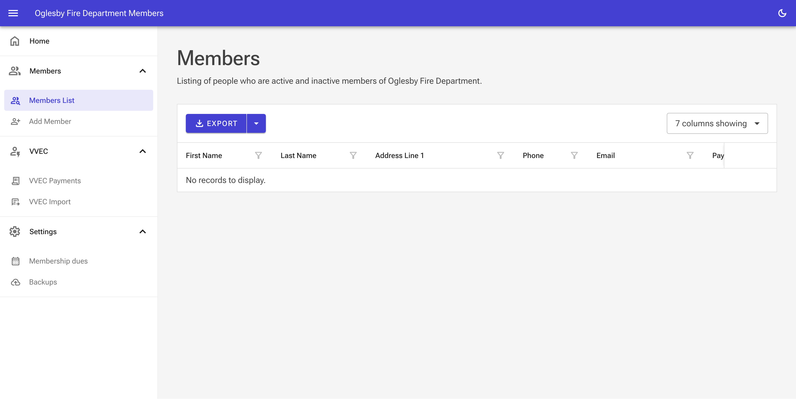

# Oglesby Fire Department Members

A friendly, single‑PC web app for tracking people, properties, annual assessments, and payments for a small fire department. This is intended to be a more accessible way to view relational data without complicated spreadsheets, or maintaining a Microsoft Access database.

This was a fun project for my local volunteer fire department. Ultiamtely, they were not able to use this due to a change of hands with the person who manages this data, but worth keeping around for reference in the future.

Be aware this project works, but was not completed and will have bugs/funkiness to it.

---

## Why This Exists

Small orgs need simple tools. This app keeps tabs on:
- People and their mailing addresses and aliases
- Properties and ownership
- Annual fee schedules and assessments per property
- Payments and automatic allocations
- Utility notices import + matching (with a PDF parser for exact name capture)
- Low‑friction backups and daily/weekly automation

All with guardrails: unique constraints, no cascade deletes, idempotent jobs, and transactions around money.

---

## Tech Stack

- .NET 10 + ASP.NET Core Razor Components (Blazor Server)
- Entity Framework Core 10 with SQLite
- Radzen.Blazor components for productive UI
- Mediator (source generator) for clean, decoupled operations
- UglyToad.PdfPig for parsing utility PDFs
- ClosedXML for spreadsheet I/O
- Serilog (wiring available; easy to enable)

Solution layout:
- `src/OglesbyFDMembers.App` – Web UI, services, background jobs, startup
- `src/OglesbyFDMembers.Data` – EF Core DbContext + configurations + migrations
- `src/OglesbyFDMembers.Domain` – Entities, enums, validation stubs
- `src/OglesbyFDMembers.Tools` – Console utilities scaffold (future)

---

## Features at a Glance

- People + Properties: create, edit, aliasing, mailing addresses
- Assessments: one per property per year (enforced unique index)
- Rollover: idempotently creates missing assessments for a target year
- Payments: automatic allocation to open assessments; split handling
- Utility Import: CSV/PDF parsing and alias matching helpers
- Backups: one‑click SQLite backups via `VACUUM INTO`; retention policy
- Jobs: daily assessment/auto‑allocation and daily/weekly backups
- Health: `/health/db` endpoint checks connectivity and migrations

---

## Run It Locally

Prerequisites
- .NET SDK 10.0+
- Windows recommended (default data path is Windows‑style), but works anywhere

Quick start

```
# From repo root
cd src/OglesbyFDMembers.App

# Restore, build, and run
dotnet restore
dotnet build
dotnet run
```

Then open the URL printed to the console (typically https://localhost:5xxx).

Migrations
- The app applies EF Core migrations automatically on startup (`Database.Migrate()`).
- If you change entities, add a migration locally with:
  ```
  dotnet ef migrations add MeaningfulName -p ../OglesbyFDMembers.Data -s .
  dotnet ef database update -p ../OglesbyFDMembers.Data -s .
  ```

---

## Configuration

SQLite location
- Default connection is set in `src/OglesbyFDMembers.App/appsettings.json` to a Windows path:
  `Data Source=C:\\Data\\OglesbyFD\\oglesbyfdmembers.db;Cache=Shared;Foreign Keys=True;`
- To use a custom location or a non‑Windows path:
  - Edit `ConnectionStrings:DefaultConnection` in `appsettings.json`, or
  - Provide an environment variable `ConnectionStrings__DefaultConnection`.
- Relative paths are normalized to absolute on startup and the directory is created if needed.

Backups
- Configure a backup folder in the Settings UI.
- Manual backups use SQLite `VACUUM INTO` for fast, consistent snapshots.
- Retention keeps daily backups for 14 days and weekly backups for 16 weeks (manual backups are kept).

Health checks
- `GET /health/db` returns JSON with connectivity, pending migration count, and provider info.

---

## Data Model Highlights

Core entities
- `Person`, `PersonAlias`, `PersonAddress`
- `Property`, `Ownership`
- `Assessment`, `FeeSchedule`
- `Payment`, `PaymentAllocation`
- `UtilityNotice`, `AppSetting`

Important rules
- Unique: one `Assessment` per `(PropertyId, Year)`
- No cascade deletes: enforced via `DeleteBehavior.Restrict`
- Money operations: transaction‑wrapped and idempotent where applicable

---

## Notable Design Choices

- Idempotent year rollover that only creates missing rows and leaves existing data untouched
- Auto‑allocation for payments with an exact‑cover fast path and sensible split behavior
- SQLite PRAGMAs (WAL, busy_timeout, foreign_keys) applied on every connection
- Background services for daily/weekly routines without external schedulers
- Small, composable services instead of a monolith “manager”

---

## Screenshots



---

## Development Notes

- Migrations live in `OglesbyFDMembers.Data`. Don’t hand‑write them; use `dotnet ef`.
- App will migrate the DB on startup; failed migrations show a friendly startup message and log details.
- Delete behavior is globally switched to `Restrict` at model build.
